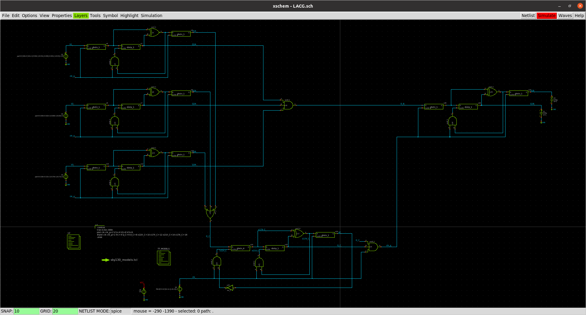
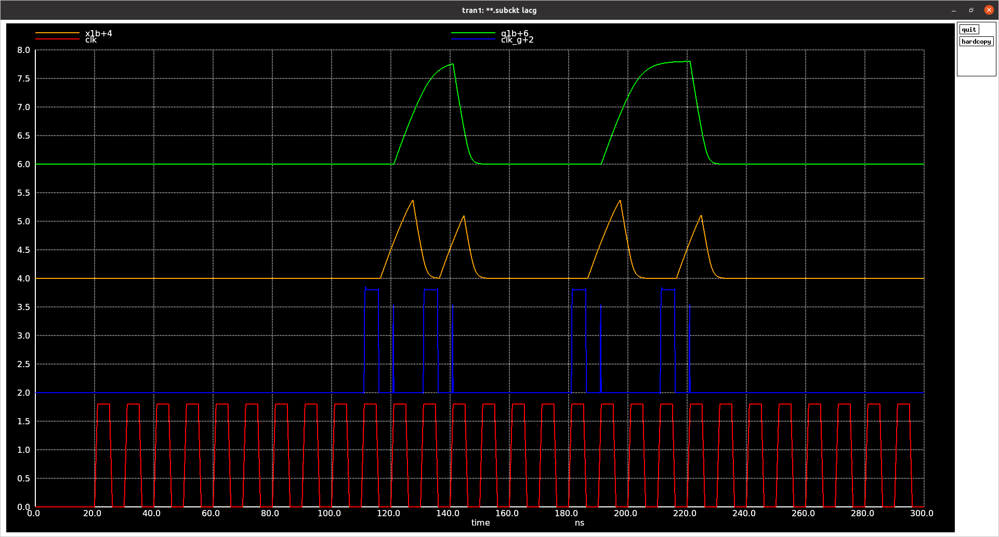

# LACG
A simple clock gating circuit inspired by [A Look-Ahead Clock Gating Based on Auto-Gated Flip-Flops](https://sci-hub.do/https://ieeexplore.ieee.org/document/6693753)

Setup Instruction
1) cp -rf .xschem/ $HOME
2) Install SKY130 requirements using scripts located at https://github.com/mabrains/sky130_ubuntu_setup

Credit: Thanks to [Stefan Schippers](https://github.com/StefanSchippers) for helping with SKY130 PDK
