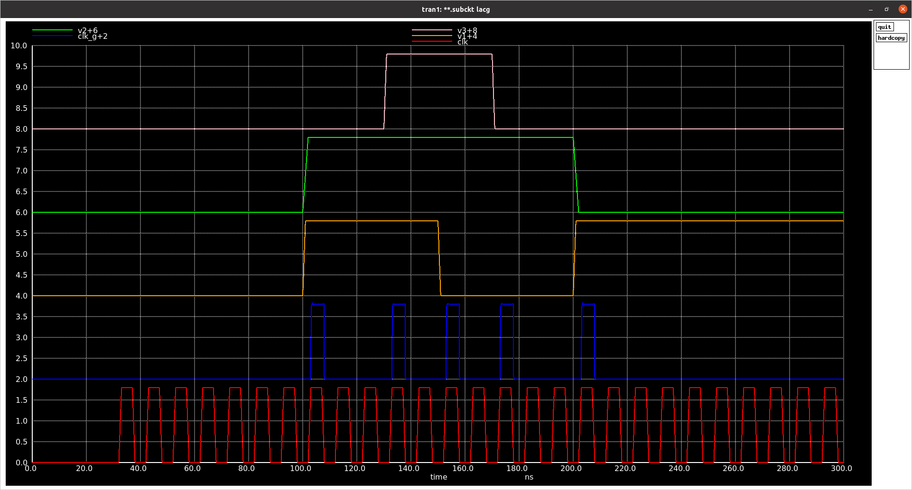

# LACG
A simple clock gating circuit inspired by [A Look-Ahead Clock Gating Based on Auto-Gated Flip-Flops](https://sci-hub.do/https://ieeexplore.ieee.org/document/6693753)

Setup Instruction
1) cp -rf .xschem/ $HOME
2) Install SKY130 requirements using scripts located at https://github.com/mabrains/sky130_ubuntu_setup

Note: Read also [LACG details](https://electronics.stackexchange.com/questions/532665/questions-about-a-look-ahead-clock-gating-based-on-auto-gated-flip-flops) and [generic clock gate timing](https://electronics.stackexchange.com/questions/551868/why-for-setup-check-and-gates-use-rising-edge-while-or-gates-use-falling-edge-a)

Credit: Thanks to [Stefan Schippers](https://github.com/StefanSchippers) for helping with SKY130 PDK
